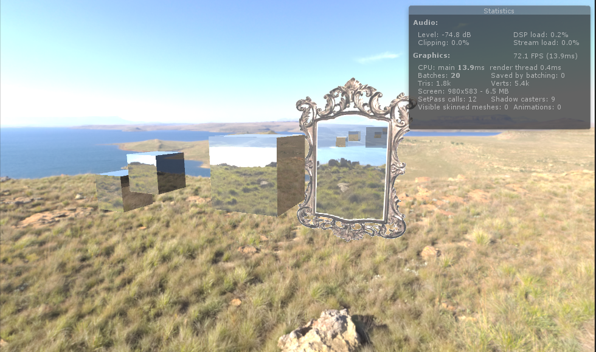

# Raytraced-Reflections-in-Unity
A very simple and hacky implementation of raytraced reflections in unity. Theoretically it runs on everything that is compute capable, rtx is not requied. Based on: http://blog.three-eyed-games.com/2018/05/03/gpu-ray-tracing-in-unity-part-1/

This is not in any way shape or form usable, i just wanted to try it out just cause you can.

